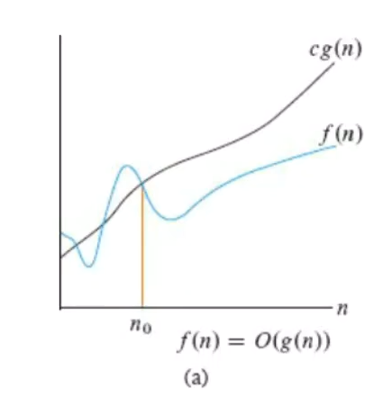
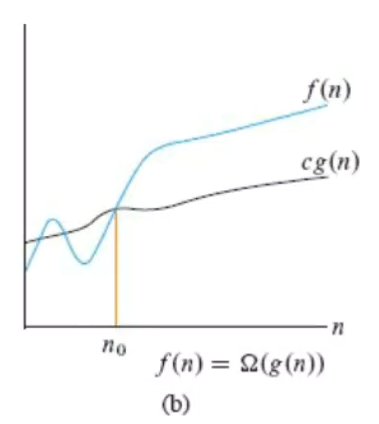
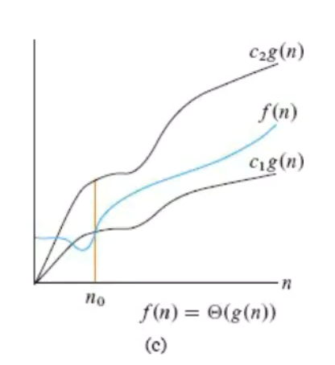

# 时间复杂度

### 1. **Asymptotic Upper Bound**: 渐进上界

### 2. **Asymptotic Lower Bound**: 渐进下界

### 3. **Asymptotic Tight Bound**: 渐进紧界

### 4. O(1)<O(log_n)<O(n)<O(n*log_n)<O( n^2 )<O(2^n)<O(n!)

# 空间复杂度
